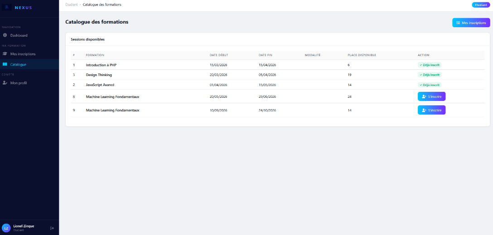
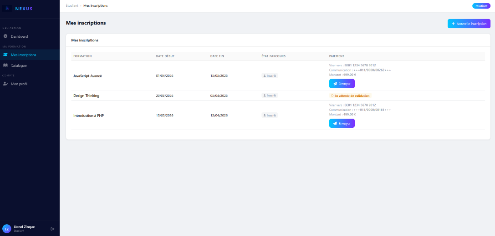
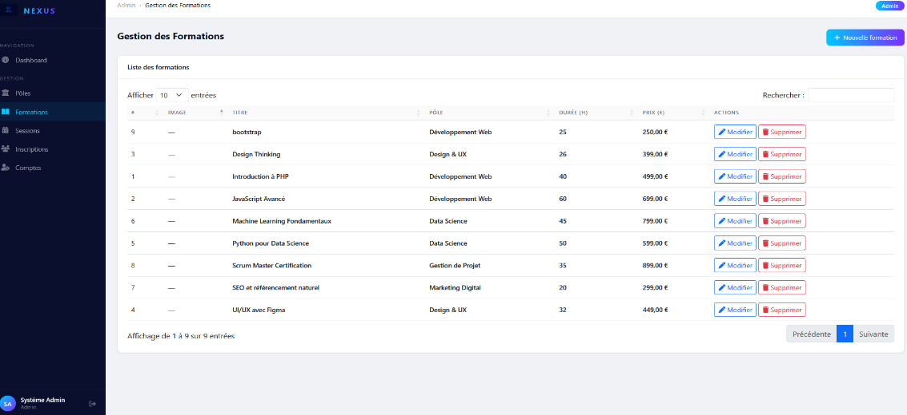

# NEXUS — Plateforme de gestion de centre de formation

Application web full-stack de gestion pour un centre de formation, développée avec CodeIgniter 4. Gère les inscriptions, les sessions de formation et l'administration à travers quatre rôles utilisateurs distincts (Visiteur, Étudiant, Formateur, Administrateur), et expose une API REST authentifiée par token.


## Aperçu

| Catalogue des sessions | Espace étudiant (inscriptions et paiement) | Administration des formations |
|---|---|---|
|  |  |  |

## Sommaire

- [Fonctionnalités](#fonctionnalités)
- [Stack technique](#stack-technique)
- [Points techniques notables](#points-techniques-notables)
- [Installation](#installation)
- [Comptes de démonstration](#comptes-de-démonstration)
- [API REST](#api-rest)
- [Tests](#tests)
- [Résolution de problèmes](#résolution-de-problèmes)
- [Structure du projet](#structure-du-projet)
- [Ce que j'ai appris](#ce-que-jai-appris)

## Fonctionnalités

- **Gestion multi-rôles** : Visiteur (catalogue public), Étudiant (inscriptions, suivi), Formateur (planning, historique), Administrateur (gestion complète)
- **Catalogue de formations** consultable publiquement, avec détails et sessions disponibles
- **Système d'inscription** avec gestion des places, sessions en présentiel ou à distance
- **Validation administrative des paiements** par virement bancaire, avec communication structurée belge (sans paiement en ligne)
- **Gestion des pôles, formations et sessions** côté administrateur, avec upload d'images
- **Recherche et filtres dynamiques** via AJAX/DataTables
- **API REST** : catalogue public et endpoints protégés par token

## Stack technique

| Domaine | Technologie |
|---|---|
| Backend | PHP 8.1+, CodeIgniter 4.6 (MVC) |
| Base de données | MySQL 8 (compatible MariaDB) |
| Frontend | Bootstrap 5, jQuery, DataTables |
| Requêtes asynchrones | AJAX |
| API | REST / JSON, authentification Bearer token |
| Tests | PHPUnit 10 (tests unitaires, base de données et fonctionnels) |
| Environnement de dev | WampServer |

## Points techniques notables

Quelques choix d'implémentation qui ont demandé une réflexion particulière :

- **Priorité des rôles en base de données** : quand un compte cumule plusieurs rôles, la priorité (Admin > Formateur > Étudiant) est résolue directement en SQL via `ORDER BY FIELD(...) LIMIT 1` dans `UserModel`, plutôt que par une logique conditionnelle dans le contrôleur — un choix qui centralise la règle métier au bon endroit.
- **Gestion de clés composites** : `InscriptionModel` implémente des méthodes `updateByKeys()` / `deleteByKeys()` sur mesure, CodeIgniter 4 ne gérant pas nativement les clés primaires composites.
- **Tokens API hashés** : seule l'empreinte SHA-256 du token est stockée en base. En cas de fuite de la base, les tokens ne sont pas réutilisables. SHA-256 (et non `password_hash`) suffit ici, car le token est un secret aléatoire de 256 bits, pas un mot de passe choisi par un humain.
- **Protection contre le brute force** : `/api/login` est limité à 5 tentatives par IP grâce au Throttler de CodeIgniter (algorithme du seau à jetons), avec une réponse `429 Too Many Requests`.
- **Compatibilité cross-plateforme des uploads** : les noms de fichiers uploadés sont normalisés en minuscules (`strtolower()`) pour éviter les problèmes de casse entre systèmes de fichiers (Windows en développement, Linux en production).
- **Sessions en base de données** : passage du gestionnaire de sessions CI4 par défaut vers un handler base de données pour fiabiliser la persistance de session sous WAMP.
- **Seul `public/` est exposé** : le point d'entrée est `public/index.php`, et un `.htaccess` à la racine bloque l'accès à `.env`, `app/` et `writable/` si le projet est placé dans le dossier web du serveur.

## Installation

### Prérequis

| Logiciel | Version minimale | Notes |
|---|---|---|
| PHP | 8.1+ | Extensions : `intl`, `mbstring`, `json`, `mysqlnd`, `openssl` |
| MySQL | 8.0+ | ou MariaDB 10.6+ |
| Serveur web | Apache 2.4 | WampServer 3.3+ (inclut Apache, PHP et MySQL), XAMPP, ou `php spark serve` |

> ⚠️ Si l'extension `intl` n'est pas activée, CodeIgniter 4 affiche une erreur au démarrage. Sous WampServer : *PHP → PHP extensions → php_intl*.

### 1. Récupérer le code

```bash
cd C:\wamp64\www          # ou le dossier web de votre serveur
git clone https://github.com/Lio-Be/Nexus-projetWeb.git nexus
cd nexus
```

Le framework CodeIgniter est inclus dans `system/` : aucune dépendance Composer n'est nécessaire pour lancer l'application.

### 2. Configurer l'environnement

```bash
cp env .env
php spark key:generate
```

Puis, dans `.env`, adapter si nécessaire :

- `app.baseURL` : `http://localhost/nexus/public/` sous WAMP, ou `http://localhost:8080/` avec `php spark serve` ;
- `database.default.*` : identifiants MySQL (le mot de passe `root` est vide par défaut sous WampServer).

### 3. Créer la base de données

Via phpMyAdmin (`http://localhost/phpmyadmin`) : créer la base `nexus_formations` (interclassement `utf8mb4_unicode_ci`), puis l'onglet **Importer** → `database/nexus.sql`.

Ou en ligne de commande :

```bash
mysql -u root -p -e "CREATE DATABASE nexus_formations CHARACTER SET utf8mb4 COLLATE utf8mb4_unicode_ci"
mysql -u root -p nexus_formations < database/nexus.sql
```

Enfin, créer la table des tokens API via les migrations :

```bash
php spark migrate
```

La base contient alors 9 tables : `comptes`, `roles`, `compte_roles`, `poles`, `formations`, `sessions`, `inscriptions`, `ci_sessions` et `api_tokens` (plus la table technique `migrations`).

### 4. Lancer l'application

- **WampServer** : ouvrir `http://localhost/nexus/public`
- **Serveur intégré** : `php spark serve`, puis ouvrir `http://localhost:8080`

La page d'accueil et le catalogue public doivent s'afficher.

## Comptes de démonstration

Les données sont fictives. Tous les comptes ont le mot de passe **`password`**.

| Email | Rôle | Redirection après connexion |
|---|---|---|
| `admin@nexus.com` | Administrateur | `/admin/dashboard` |
| `claire.moreau@formateur.com` | Formateur | `/formateur/dashboard` |
| `jean.leclerc@formateur.com` | Formateur + Étudiant (priorité Formateur) | `/formateur/dashboard` |
| `marie.dupont@test.com` | Étudiant | `/etudiant/dashboard` |
| `pierre.martin@test.com` | Étudiant | `/etudiant/dashboard` |

> ⚠️ Changer ces mots de passe avant toute mise en production.

## API REST

Base : `http://localhost/nexus/public/api` (ou `http://localhost:8080/api` avec `php spark serve`).

| Méthode | Endpoint | Accès | Description |
|---|---|---|---|
| `GET` | `/api/formations` | Public | Catalogue des formations avec leur pôle |
| `POST` | `/api/login` | Public, 5 tentatives par IP | Retourne un token valable 24 h |
| `GET` | `/api/mes-inscriptions` | Token requis | Inscriptions du compte connecté |

**1. Obtenir un token**

```bash
curl -X POST http://localhost/nexus/public/api/login \
     -H "Content-Type: application/json" \
     -d '{"email": "marie.dupont@test.com", "password": "password"}'
```

```json
{
    "status": 200,
    "token": "52fa8f92dc4d87a3...",
    "expire": "2026-09-30 20:04:56"
}
```

**2. Appeler un endpoint protégé**

```bash
curl http://localhost/nexus/public/api/mes-inscriptions \
     -H "Authorization: Bearer <token>"
```

Codes de réponse : `401` si le token est absent, invalide ou expiré ; `429` après 5 tentatives de connexion rapprochées.

## Tests

Le projet contient des tests unitaires, des tests sur la base de données et des tests fonctionnels (requêtes HTTP simulées via le routeur CodeIgniter) :

| Fichier | Ce qui est testé |
|---|---|
| `tests/unit/GenerateStructuredComTest.php` | Calcul de la communication structurée (clé de contrôle modulo 97) |
| `tests/database/RolePrioriteTest.php` | Priorité des rôles Admin > Formateur > Étudiant |
| `tests/feature/EtudiantModifierProfilTest.php` | Modification du profil étudiant (session, filtre, validation, CSRF) |
| `tests/feature/FormateurModifierProfilTest.php` | Modification du profil formateur |
| `tests/feature/ApiAuthTest.php` | Login API, token hashé, endpoint protégé, token expiré, limite de tentatives |

Les tests utilisent une base MySQL dédiée, `nexus_test`, pour ne jamais toucher aux données de développement :

```bash
# 1. Créer la base de test avec le même schéma
mysql -u root -p -e "CREATE DATABASE nexus_test CHARACTER SET utf8mb4 COLLATE utf8mb4_unicode_ci"
mysql -u root -p nexus_test < database/nexus.sql

# 2. Configuration locale (y renseigner le mot de passe MySQL si besoin)
cp phpunit.xml.dist phpunit.xml

# 3. Télécharger PHPUnit et lancer les tests
curl -LO https://phar.phpunit.de/phpunit-10.phar
php phpunit-10.phar
```

## Résolution de problèmes

| Symptôme | Vérifications |
|---|---|
| Erreur 404 ou 403 | L'URL doit pointer sur `public/` : `http://localhost/nexus/public`, et non `http://localhost/nexus` |
| Écran blanc au démarrage | `.env` présent à la racine avec `CI_ENVIRONMENT = development` ; vider `writable/cache/` |
| Erreur de connexion à la base | MySQL démarré, paramètres `database.default.*` corrects dans `.env`, base `nexus_formations` existante |
| La session se réinitialise à chaque requête | La table `ci_sessions` existe et `session.savePath = ci_sessions` dans `.env` |
| `/api/login` renvoie une erreur 500 | Lancer `php spark migrate` pour créer la table `api_tokens` |
| Les images uploadées ne s'affichent pas | Le dossier `public/uploads/formations/` existe et est accessible en écriture |
| Sous Windows, le cache ou les logs ne s'écrivent pas | Retirer l'attribut « lecture seule » des sous-dossiers de `writable/` |

## Structure du projet

```
nexus/
├── app/
│   ├── Config/            # Routes, filtres, base de données
│   ├── Controllers/
│   │   ├── Admin/         # CRUD pôles, formations, sessions, inscriptions, comptes
│   │   ├── Api/           # API REST : formations, login, inscriptions
│   │   ├── Etudiant/      # Tableau de bord, catalogue, inscriptions, paiement
│   │   ├── Formateur/     # Planning, historique, inscriptions
│   │   ├── Auth.php       # Connexion, déconnexion, inscription
│   │   └── Home.php       # Accueil et catalogue publics
│   ├── Database/
│   │   └── Migrations/    # Table api_tokens
│   ├── Filters/           # Contrôle d'accès par rôle, token API, limite de tentatives
│   ├── Helpers/           # Validation IBAN et communication structurée
│   ├── Models/            # UserModel, InscriptionModel, ApiTokenModel, ...
│   └── Views/             # Templates par rôle (admin, formateur, etudiant, home, auth)
├── database/
│   └── nexus.sql          # Schéma et données de démonstration
├── docs/
│   └── academique/        # Documentation de conception (méthodologie Merise, RUP)
├── public/                # Point d'entrée (index.php) et assets statiques
├── system/                # Framework CodeIgniter 4
├── tests/                 # Tests PHPUnit
└── writable/              # Cache, logs, sessions, uploads
```

## Ce que j'ai appris

- Structurer une application MVC de taille réelle en solo, avec une séparation claire des responsabilités par rôle utilisateur
- Modéliser une base de données relationnelle avec la méthode Merise (MCD → MLD → MPD) et gérer les cas de clés composites qui en découlent
- Concevoir une API REST sécurisée : authentification par token, stockage hashé, limitation des tentatives
- Écrire des tests automatisés (unitaires, base de données, fonctionnels) pour sécuriser les évolutions
- Déboguer des problèmes de compatibilité cross-plateforme (casse des fichiers, gestion de sessions) rencontrés uniquement en conditions réelles
- Documenter et présenter un projet technique de façon à ce qu'il reste compréhensible et maintenable

> **Évolution prévue** : installer CodeIgniter via Composer (`vendor/`) plutôt que de l'embarquer dans `system/`.

## Licence

Code du projet sous licence [MIT](LICENSE). Le framework CodeIgniter 4 inclus dans `system/` est distribué sous sa propre licence MIT ([system/LICENSE](system/LICENSE)).

---

*Projet réalisé dans le cadre d'une formation (session 2025-2026), puis enrichi : tests automatisés, sécurité renforcée, API REST.*
